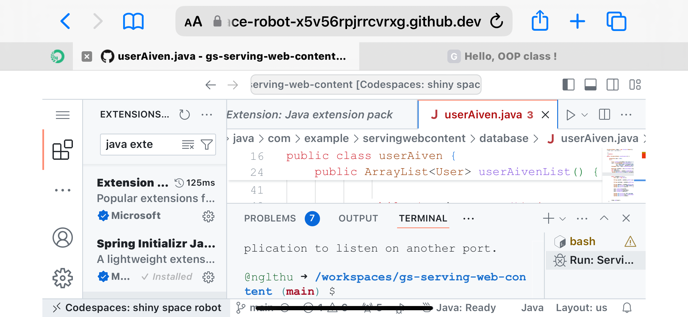
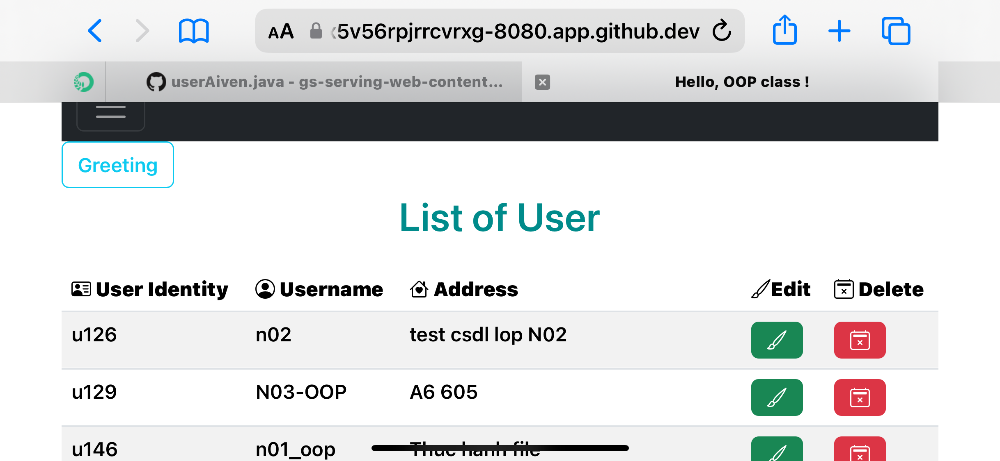

# Java Spring io With Codesapces
# Project: Use Codespaces with Java Spring io and mysql database Aiven.io

# Codespace 

For convinience of everywhere coding and bugging



# Resultset and ArrayList




:spring_version: current
:Controller: http://docs.spring.io/spring/docs/{spring_version}/javadoc-api/org/springframework/stereotype/Controller.html
:RequestParam: http://docs.spring.io/spring/docs/{spring_version}/javadoc-api/org/springframework/web/bind/annotation/RequestParam.html
:View: http://docs.spring.io/spring/docs/{spring_version}/javadoc-api/org/springframework/web/servlet/View.html
:Model: http://docs.spring.io/spring/docs/{spring_version}/javadoc-api/org/springframework/ui/Model.html
:toc:
:icons: font
:source-highlighter: prettify
:project_id: gs-serving-web-content

This guide walks you through the process of creating a "`Hello, World`" web site with
Spring.

## What You Will Build

You will build an application that has a static home page and that will also accept HTTP
GET requests at: `http://localhost:8080/greeting`.

It will respond with a web page that displays HTML. The body of the HTML will contain a
greeting: "`Hello, World!`"

You can customize the greeting with an optional `name` parameter in the query string. The
URL might then be `http://localhost:8080/greeting?name=User`.

The `name` parameter value overrides the default value of `World` and is reflected in the
response by the content changing to "`Hello, User!`"

## What You Need

:java_version: 17
include::https://raw.githubusercontent.com/spring-guides/getting-started-macros/main/prereq_editor_jdk_buildtools.adoc[]

include::https://raw.githubusercontent.com/spring-guides/getting-started-macros/main/how_to_complete_this_guide.adoc[]

[[scratch]]
== Starting with Spring Initializr

You can use this https://start.spring.io/#!type=maven-project&language=java&packaging=jar&jvmVersion=11&groupId=com.example&artifactId=serving-web-content&name=serving-web-content&description=Demo%20project%20for%20Spring%20Boot&packageName=com.example.serving-web-content&dependencies=web,thymeleaf,devtools[pre-initialized project] and click Generate to download a ZIP file. This project is configured to fit the examples in this tutorial.

To manually initialize the project:

. Navigate to https://start.spring.io.
This service pulls in all the dependencies you need for an application and does most of the setup for you.
. Choose either Gradle or Maven and the language you want to use. This guide assumes that you chose Java.
. Click *Dependencies* and select *Spring Web*, *Thymeleaf*, and *Spring Boot DevTools*.
. Click *Generate*.
. Download the resulting ZIP file, which is an archive of a web application that is configured with your choices.

NOTE: If your IDE has the Spring Initializr integration, you can complete this process from your IDE.

NOTE: You can also fork the project from Github and open it in your IDE or other editor.

[[initial]]
## Create a Web Controller

In Spring's approach to building web sites, HTTP requests are handled by a controller. You
can easily identify the controller by the {Controller}[`@Controller`] annotation. In the
following example, `GreetingController` handles GET requests for `/greeting` by returning
the name of a {View}[`View`] (in this case, `greeting`). A `View` is responsible for
rendering the HTML content. The following listing (from
`src/main/java/com/example/servingwebcontent/GreetingController.java`) shows the
controller:


[source,java]
```
include::complete/src/main/java/com/example/servingwebcontent/GreetingController.java[]
```


This controller is concise and simple, but there is plenty going on. We break it down step
by step.

The `@GetMapping` annotation ensures that HTTP GET requests to `/greeting` are mapped to
the `greeting()` method.

{RequestParam}[`@RequestParam`] binds the value of the query string parameter `name` into
the `name` parameter of the `greeting()` method. This query string parameter is not
`required`. If it is absent in the request, the `defaultValue` of `World` is used. The
value of the `name` parameter is added to a {Model}[`Model`] object, ultimately making it
accessible to the view template.

The implementation of the method body relies on a view technology (in this case,
http://www.thymeleaf.org/doc/tutorials/2.1/thymeleafspring.html[Thymeleaf]) to perform
server-side rendering of the HTML. Thymeleaf parses the `greeting.html` template and
evaluates the `th:text` expression to render the value of the `${name}` parameter that was
set in the controller.The following listing (from
`src/main/resources/templates/greeting.html`) shows the `greeting.html` template:

====
[source,html]
----
include::complete/src/main/resources/templates/greeting.html[]
----
====

TIP: Make sure you have Thymeleaf on your classpath (artifact co-ordinates: `org.springframework.boot:spring-boot-starter-thymeleaf`). It is already there in the "initial" and "complete" samples in Github.

== Spring Boot Devtools

A common feature of developing web applications is coding a change, restarting your
application, and refreshing the browser to view the change. This entire process can eat up
a lot of time. To speed up this refresh cycle, Spring Boot offers with a handy module
known as
http://docs.spring.io/spring-boot/docs/current/reference/htmlsingle/#using-boot-devtools[spring-boot-devtools].
Spring Boot Devtools:

* Enables
http://docs.spring.io/spring-boot/docs/current/reference/htmlsingle/#howto-hotswapping[hot swapping].
* Switches template engines to disable caching.
* Enables LiveReload to automatically refresh the browser.
* Other reasonable defaults based on development instead of production.

== Run the Application

The Spring Initializr creates an application class for you. In this case, you need not
further modify the class provided by the Spring Initializr. The following listing (from
`src/main/java/com/example/servingwebcontent/ServingWebContentApplication.java`) shows the
application class:

====
[source,java]
----
include::complete/src/main/java/com/example/servingwebcontent/ServingWebContentApplication.java[]
----
====

include::https://raw.githubusercontent.com/spring-guides/getting-started-macros/main/spring-boot-application-new-path.adoc[]

include::https://raw.githubusercontent.com/spring-guides/getting-started-macros/main/build_an_executable_jar_subhead.adoc[]

include::https://raw.githubusercontent.com/spring-guides/getting-started-macros/main/build_an_executable_jar_with_both.adoc[]

Logging output is displayed. The application should be up and running within a few seconds.

== Test the Application

Now that the web site is running, visit `http://localhost:8080/greeting`, where you should
see "`Hello, World!`"

Provide a `name` query string parameter by visiting
`http://localhost:8080/greeting?name=User`. Notice how the message changes from
"`Hello, World!`" to "`Hello, User!`":

This change demonstrates that the {RequestParam}[`@RequestParam`] arrangement in
`GreetingController` is working as expected. The `name` parameter has been given a default
value of `World`, but it can be explicitly overridden through the query string.

== Add a Home Page

Static resources, including HTML and JavaScript and CSS, can be served from your Spring
Boot application by dropping them into the right place in the source code. By default,
Spring Boot serves static content from resources in the classpath at `/static` (or
`/public`). The `index.html` resource is special because, if it exists, it is used as a
"welcome page", which means it is served up as the root resource (that is, at
`http://localhost:8080/`). As a result, you need to create the following file (which you
can find in `src/main/resources/static/index.html`):

====
[source,html]
----
include::complete/src/main/resources/static/index.html[]
----
====

When you restart the application, you will see the HTML at `http://localhost:8080/`.

== Summary

Congratulations! You have just developed a web page by using Spring.

== See Also

The following guides may also be helpful:

* https://spring.io/guides/gs/spring-boot/[Building an Application with Spring Boot]
* https://spring.io/guides/gs/accessing-data-gemfire/[Accessing Data with GemFire]
* https://spring.io/guides/gs/accessing-data-jpa/[Accessing Data with JPA]
* https://spring.io/guides/gs/accessing-data-mongodb/[Accessing Data with MongoDB]
* https://spring.io/guides/gs/accessing-data-mysql/[Accessing data with MySQL]
* https://spring.io/guides/gs/testing-web/[Testing the Web Layer]
* https://spring.io/guides/gs/rest-service/[Building a RESTful Web Service]

include::https://raw.githubusercontent.com/spring-guides/getting-started-macros/main/footer.adoc[]

# To run

```
mvn spring-boot:run

```
# Database

[Connect to Aivan from CLI](https://aiven.io/docs/products/mysql/howto/connect-from-cli)


https://www.geeksforgeeks.org/advance-java/how-to-access-values-from-application-properties-in-spring-boot/

https://www.javaguides.net/2024/09/spring-boot-3-and-hibernate-6-example.html

```
   <dependency>
            <groupId>org.springframework.boot</groupId>
            <artifactId>spring-boot-starter-data-jpa</artifactId>
        </dependency>


Create an application.properties file in the src/main/resources directory with the following content:

spring.datasource.url=jdbc:mysql://localhost:3306/your_database_name
spring.datasource.username=your_username
spring.datasource.password=your_password
spring.datasource.driver-class-name=com.mysql.cj.jdbc.Driver
spring.jpa.hibernate.ddl-auto=update
spring.jpa.show-sql=true
spring.jpa.properties.hibernate.format_sql=true
spring.jpa.properties.hibernate.dialect=org.hibernate.dialect.MySQLDialect

```

Create a Book class in the com.example.springboothibernateexample.model package:
```
package com.example.springboothibernateexample.model;

import jakarta.persistence.Entity;
import jakarta.persistence.GeneratedValue;
import jakarta.persistence.GenerationType;
import jakarta.persistence.Id;

@Entity
public class Book {

    @Id
    @GeneratedValue(strategy = GenerationType.IDENTITY)
    private Long id;
    private String title;
    private String author;
    private double price;

    // Getters and Setters
    public Long getId() {
        return id;
    }

    public void setId(Long id) {
        this.id = id;
    }

    public String getTitle() {
        return title;
    }

    public void setTitle(String title) {
        this.title = title;
    }

    public String getAuthor() {
        return author;
    }

    public void setAuthor(String author) {
        this.author = author;
    }

    public double getPrice() {
        return price;
    }

    public void setPrice(double price) {
        this.price = price;
    }
}

```

Create a repository interface for the Book entity in the com.example.springboothibernateexample.repository package:
```
package com.example.springboothibernateexample.repository;

import com.example.springboothibernateexample.model.Book;
import org.springframework.data.jpa.repository.JpaRepository;

public interface BookRepository extends JpaRepository<Book, Long> {
}

```

Create a service class to handle business logic in the com.example.springboothibernateexample.service package:

```

package com.example.springboothibernateexample.service;

import com.example.springboothibernateexample.model.Book;
import com.example.springboothibernateexample.repository.BookRepository;
import org.springframework.beans.factory.annotation.Autowired;
import org.springframework.stereotype.Service;

import java.util.List;
import java.util.Optional;

@Service
public class BookService {

    @Autowired
    private BookRepository bookRepository;

    public Book saveBook(Book book) {
        return bookRepository.save(book);
    }

    public List<Book> getAllBooks() {
        return bookRepository.findAll();
    }

    public Optional<Book> getBookById(Long id) {
        return bookRepository.findById(id);
    }

    public Book updateBook(Book book) {
        return bookRepository.save(book);
    }

    public void deleteBook(Long id) {
        bookRepository.deleteById(id);
    }
}

```

Create a controller class to handle HTTP requests in the com.example.springboothibernateexample.controller package:
```
package com.example.springboothibernateexample.controller;

import com.example.springboothibernateexample.model.Book;
import com.example.springboothibernateexample.service.BookService;
import org.springframework.beans.factory.annotation.Autowired;
import org.springframework.http.ResponseEntity;
import org.springframework.web.bind.annotation.*;

import java.util.List;

@RestController
@RequestMapping("/api/books")
public class BookController {

    @Autowired
    private BookService bookService;

    @PostMapping
    public Book createBook(@RequestBody Book book) {
        return bookService.saveBook(book);
    }

    @GetMapping
    public List<Book> getAllBooks() {
        return bookService.getAllBooks();
    }

    @GetMapping("/{id}")
    public ResponseEntity<Book> getBookById(@PathVariable Long id) {
        return bookService.getBookById(id)
                .map(book -> ResponseEntity.ok().body(book))
                .orElse(ResponseEntity.notFound().build());
    }

    @PutMapping("/{id}")
    public ResponseEntity<Book> updateBook(@PathVariable Long id, @RequestBody Book bookDetails) {
        return bookService.getBookById(id)
                .map(book -> {
                    book.setTitle(bookDetails.getTitle());
                    book.setAuthor(bookDetails.getAuthor());
                    book.setPrice(bookDetails.getPrice());
                    Book updatedBook = bookService.updateBook(book);
                    return ResponseEntity.ok().body(updatedBook);
                }).orElse(ResponseEntity.notFound().build());
    }

    @DeleteMapping("/{id}")
    public ResponseEntity<Void> deleteBook(@PathVariable Long id) {
        return bookService.getBookById(id)
                .map(book -> {
                    bookService.deleteBook(id);
                    return ResponseEntity.ok().<Void>build();
                }).orElse(ResponseEntity.notFound().build());
    }
}

```

Run the Spring Boot application from your IDE or from the command line using the following command:

mvn spring-boot:run